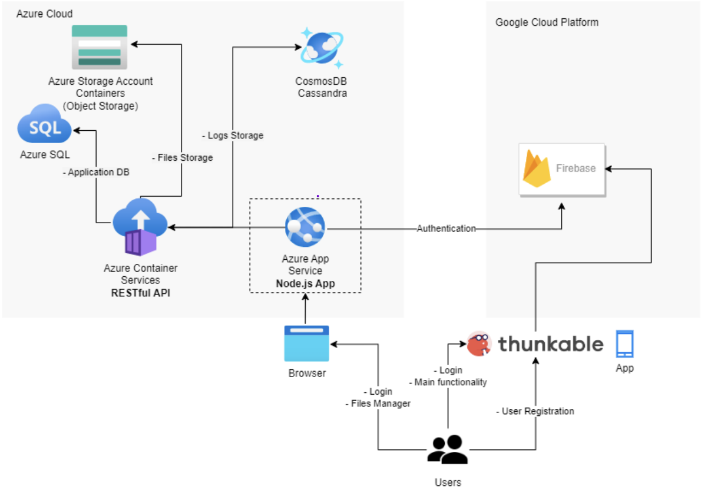
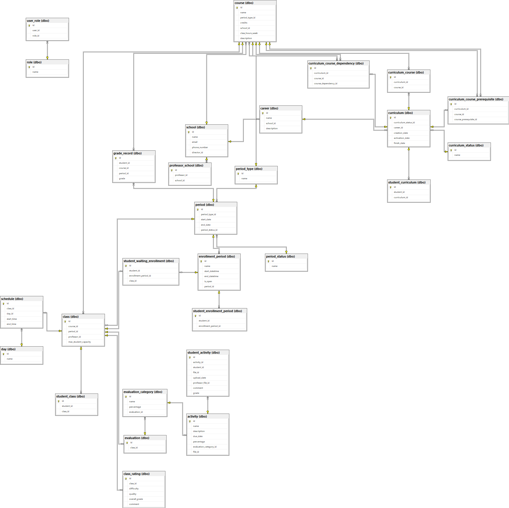

# EduHub <!-- omit in toc -->

- [1. Diagramas](#1-diagramas)
    - [1.1. Diagrama De Arquitectura](#11-diagrama-de-arquitectura)
    - [1.2. Diagrama De La Base De Datos](#12-diagrama-de-la-base-de-datos)
- [2. Guía De Instalación](#2-guía-de-instalación)
- [3. Uso Del Programa](#3-uso-del-programa)
    - [Función current\_enrollment\_time](#función-current_enrollment_time)
    - [Función read\_all\_enrollments\_by\_student\_id](#función-read_all_enrollments_by_student_id)
    - [Función check\_schedule\_clash](#función-check_schedule_clash)
    - [Función calculate\_enrollment\_hour\_by\_student\_id](#función-calculate_enrollment_hour_by_student_id)
    - [Función read\_all\_enrollment\_available\_courses\_by\_student\_id](#función-read_all_enrollment_available_courses_by_student_id)
    - [Función enroll\_class](#función-enroll_class)
    - [Función unenroll\_class](#función-unenroll_class)
    - [Función space\_available\_in\_class](#función-space_available_in_class)
    - [Función enrollment\_start\_time](#función-enrollment_start_time)
    - [Función enrollment\_end\_time](#función-enrollment_end_time)
    - [Función enrollment\_start\_date](#función-enrollment_start_date)
    - [Función enrollment\_end\_date](#función-enrollment_end_date)
    - [Función read\_all\_classes\_by\_course](#función-read_all_classes_by_course)
    - [Función generate\_enrollment\_report](#función-generate_enrollment_report)
    - [Función show\_reviews](#función-show_reviews)
- [4. Pruebas Realizadas](#4-pruebas-realizadas)
- [5. Resultados De Pruebas Unitarias](#5-resultados-de-pruebas-unitarias)
- [6. Conclusiones Y Recomendaciones](#6-conclusiones-y-recomendaciones)
    - [6.1. Conclusiones](#61-conclusiones)
    - [6.2. Recomendaciones](#62-recomendaciones)

## 1. Diagramas

### 1.1. Diagrama De Arquitectura



### 1.2. Diagrama De La Base De Datos



## 2. Guía De Instalación

1. Seguir los pasos del [README de la infraestructura](./src/infrastructure/README.md)
    * Las variables de entorno hay que cambiarlas para que correspondan con los datos de la infraestructura recien creada
2. Instalar [SQL Server Management Studio](https://learn.microsoft.com/en-us/sql/ssms/download-sql-server-management-studio-ssms?view=sql-server-ver16)
3. Entrar a [Azure](https://azure.microsoft.com/es-es/get-started/azure-portal)
4. Buscar el sql server creado en el terraform
5. Dentro del SQL Server, ir al apartado **Security/Networking**
6. En **Firewall rules** se debe presionar el botón de añadir su direción IPv4
    * Para cada persona que desea usar la base de datos, se le debe añadir en el botón de añadir regla de firewall
7. Logearse en SQL Server Management Studio con las credenciales que retorno el terraform
8. Abrir el archivo **src/sql/database-script-azure.sql** en SQL Server Management Studio
9. Ejecutar todo el script para crear el modelo de la base de datos
10. Instalar [Docker Desktop](https://www.docker.com/products/docker-desktop/)
11. Ir al directorio **src/docker**
12. Ejecutar el archivo **build-api.bat**
    * Desde consola:
    
        ```bash
        .\build-api.bat
        ```

    * Desde el explorador de archivos solo hay que dar doble click al archivo

13. Una vez terminado, para verificar que funcione el api, se debe ir a su cuenta de [Azure](https://azure.microsoft.com/es-es/get-started/azure-portal)
14. Dentro de Microsoft Azure se debe buscar **main-app**
15. Dentro de **main-app** en **Overview** se encuentra la url del api donde dice **Application Url**.
16. Abrir el link.
17. Si todo está correcto se desplegará lo siguiente en el navegador:


## 3. Uso Del Programa
A continuación se detallara las funcionalidades de la aplicación EduHub. Esto con el fin de dar al usuario una pequeña guía que le permita obtener el mayor provecho de dicha implementación.
1.	En la primer pantalla se va a observar la pantalla de inicio de sesión, en la cual en caso de contar con un usuario ya creado con anterioridad solo será necesario ingresar el correo y la contraseña en los campos correspondientes y seleccionar el botón “Iniciar sesión” y podrá tener ingreso al sistema si los datos ingresados con correctos, de no serlo se muestra un mensaje de error. Por otro lado, si no cuenta con usuario, deberá seleccionar el botón “Crear Usuario”
2.	Al ingresar a la opción de crear usuario se muestra una serie de campos los que deben de llenar con información personal como lo es; nombre, primer apellido, segundo apellido, correo, carnet, cédula, teléfono, contraseña, fecha de nacimiento e indicar si es un estudiante o un profesor. Luego el usuario puede elegir dos opciones para finalizar con su registro “Iniciar sesión”, lo 	que lo devolverá a la primera pantalla o “Registrar Usuario” que guardará los datos ingresados en la base de datos y su usuario estará creado.
3.	Después de iniciar sesión se despliega la siguiente pantalla, la que contiene todas las matriculas disponibles para el usuario actual en ese momento. Se muestra su tipo y su hora y fecha de inicio/fin. Aquí el usuario podrá escoger la matrícula que desea realizar.
4.	Seguidamente, se podrá visualizar la pantalla que contiene los cursos disponibles a matricular para ese usuario y esa matrícula. Al lado de cada curso existe un botón llamado “Matricular” que lleva a la siguiente pantalla y al final de todos los cursos mostrados se encuentra el botón “Generar reporte” el cual al darle clic lo redirigirá a una pantalla donde se genera el reporte de matrícula con los cursos matriculados hasta el momento, así también el profesor asignado y su horario.
5.	La siguiente pantalla después de dar clic en “Matricular, incluye todas las clases u horarios correspondiente al curso seleccionado con sus respectivos datos como lo son; profesor asignado, horario y capacidad, y a su lado una casilla seleccionable con la que elegirá que clase desea matricular. Seguidamente hay tres botones a disposición, “Matricular grupo” que confirma la matrícula del grupo elegido, “Desmarcar grupo” que elimina la matricula realizada, y un botón “Atrás” para volver a la pantalla anterior.


Para la conexión con la base de datos el sistema cuenta con funciones que cumplen este trabajo, las cuales se detallaran a continuación.
### Función current_enrollment_time
Ruta de acceso: https://main-app.livelysky-a2ba4f09.eastus.azurecontainerapps.io/eduhub/enrollments/course-classes/<enrollment_period_id>/<course_id>

Al ingresar el id de un periodo de matrícula, esta función es la encargada de retornar la hora y el día de inicio de una matrícula.

### Función read_all_enrollments_by_student_id
Ruta de acceso: https://main-app.livelysky-a2ba4f09.eastus.azurecontainerapps.io/eduhub/enrollments/<student_id>

Al ingresar el id de un estudiante, esta función retorna todas las matrículas asociadas a ese estudiante y que se encuentran abiertas en ese momento.

### Función check_schedule_clash
Al ingresar el id de un estudiante y el id de una clase, esta función verifica si el estudiante tiene alguna clase ya matriculada que pueda generar un choque de horario.

### Función calculate_enrollment_hour_by_student_id

Ruta de acceso: https://main-app.livelysky-a2ba4f09.eastus.azurecontainerapps.io/eduhub/enrollments/student-hour/<student_id>/<student_enrollment_period_id>

Al ingresar el id de un estudiante y el id de la tabla student_enrollment_period, esta función calcula la hora a la cual puede ese estudiante empezar a matricular según su promedio del periodo cursado anteriormente.
Función calculate_period_average
Al ingresar el id de un estudiante, el promedio del último periodo cursado.

### Función read_all_enrollment_available_courses_by_student_id
Ruta de acceso: https://main-app.livelysky-a2ba4f09.eastus.azurecontainerapps.io /eduhub/enrollments/available-courses/<student_id>/<enrollment_period_id>

Al ingresar el id de un estudiante y el id del periodo de matrícula, esta función retorna todos los cursos que puede matricular ese estudiante en la matrícula seleccionada.

### Función enroll_class
Ruta de acceso: https://main-app.livelysky-a2ba4f09.eastus.azurecontainerapps.io/eduhub/enrollments/enroll-class/<class_id>/<student_id>

Al ingresar el id de un estudiante y el id de una clase, esta función verifica si hay espacios disponibles para matricular en esa clase y si no existe algún choque de horario con clases ya matriculadas, de ser así esta procede a matricular esta clase vinculándola al estudiante correspondiente, de lo contrario se realizará una matrícula tentativa que pondrá en cola a ese estudiante esperando que se desocupe algún espacio.

### Función unenroll_class
Ruta de acceso: https://main-app.livelysky-a2ba4f09.eastus.azurecontainerapps.io/eduhub/enrollments/unenroll-class/<class_id>/<student_id>
Al ingresar el id de un estudiante y el id de una clase, esta función permite eliminar la matricular de la clase vinculada.

### Función space_available_in_class
Al ingresar el id de una clase, esta función retorna si existen espacios disponibles de esa clase vinculada mediante un True o si no existen con un False.

### Función enrollment_start_time
Ruta de acceso: https://main-app.livelysky-a2ba4f09.eastus.azurecontainerapps.io/eduhub/enrollments/start-time/<enrollment_period_id>

Al ingresar el id del periodo de matrícula, esta función retorna la hora de inicio de esa matricula.

### Función enrollment_end_time
Ruta de acceso: https://main-app.livelysky-a2ba4f09.eastus.azurecontainerapps.io/eduhub/enrollments/end-time/<enrollment_period_id>

Al ingresar el id del periodo de matrícula, esta función retorna la hora de fin de esa matricula.

### Función enrollment_start_date
Ruta de acceso: https://main-app.livelysky-a2ba4f09.eastus.azurecontainerapps.io/eduhub/enrollments/start-date/<enrollment_period_id>

Al ingresar el id del periodo de matrícula, esta función retorna el día de inicio de esa matricula.

### Función enrollment_end_date
Ruta de acceso: https://main-app.livelysky-a2ba4f09.eastus.azurecontainerapps.io/eduhub/enrollments/end-date/<enrollment_period_id>

Al ingresar el id del periodo de matrícula, esta función retorna el día de fin de esa matricula.

### Función read_all_classes_by_course

Ruta de acceso: https://main-app.livelysky-a2ba4f09.eastus.azurecontainerapps.io/eduhub/enrollments/course-classes/<enrollment_period_id>/<course_id>

Al ingresar el id del periodo de matrícula y el id de una clase, esta función retorna todas las clases asocias a este grupo que fueron habilitadas para este periodo de matrícula.

### Función generate_enrollment_report
Ruta de acceso: https://main-app.livelysky-a2ba4f09.eastus.azurecontainerapps.io/eduhub/enrollments/report/<student_id>/<enrollment_period_id>

Al ingresar el id del periodo de matrícula y el id de un estudiante, esta función retorna todos los cursos y sus respectivas clases a las que se matriculó este usuario vinculado al periodo de matrícula ingresado.

### Función show_reviews
Ruta de acceso: https://main-app.livelysky-a2ba4f09.eastus.azurecontainerapps.io/eduhub/enrollments/reviews/<class_id>

Al ingresar el id de una clase, esta función retorna todos los comentarios sobre el profesor al que le fue asignada esa clase.

## 4. Pruebas Realizadas

## 5. Resultados De Pruebas Unitarias

## 6. Conclusiones Y Recomendaciones

### 6.1. Conclusiones
1.	El realizar el modelo de la base de datos en diagramas UML ayudó a la visualización de la estructura con la que se trabajó, lo que facilitó el entendimiento a la hora de preparar lógica de funciones.
2.	Se concluyó que el sistema aportará eficiencia a la hora de realizar matrículas en cualquier periodo del año, ahorrando de esta manera gastos monetarios y de tiempo.
3.	Se logró comprender de manera efectiva el proceso de una matrícula, en este caso, de una Universidad.
4.	Los estudiantes están de acuerdo que se implemente este software ya que beneficiaría a la comunidad educativa y administrativa
5.	Se consiguió diseñar un modelo escalable con todos los requerimientos solicitados.
6.	Se dedujo que la versión actual no es apta para usuarios con algunas discapacidades o necesidades especiales como la baja visión.
7.	Se concluye que el acceso desde una aplicación móvil a la matrícula de cursos hace más accesible este trámite ante algunas eventualidades que se pueden presentar.
8.	La documentación detallada proporcionada junto con el sistema de matrícula en línea garantiza que los usuarios puedan utilizar el sistema sin dificultades y con seguridad.
9.	Se concluye que existe una necesidad aparente en las nuevas generaciones de contar con un sistema de matrícula en los teléfonos celulares, ya que es un medio tecnológico novedoso, que permitirá realizar la matrícula sin tener que contar con una computadora.
10.	Se logró entender todos los requerimientos necesarios para que el usuario hiciera un buen uso de la herramienta.


### 6.2. Recomendaciones
1.	Se recomienda hacer pruebas de usabilidad para tomar en cuenta los comentarios y puntos de vista de usuarios para de esta manera mejorar la interfaz de usuario.
2.	Compartir por algún medio de comunicación institucional la guía de uso, ya que esto facilitará a los usuario su uso.
3.	Poner a disposición del usuario un medio de soporte al cual puedan comunicarse en caso de cualquier tipo de inconveniente con el sistema.
4.	La actualización de notas en el sistema debe de ingresarse en el tiempo estipulado para tener una buena estimación de los promedios de los estudiantes.
5.	Se debe actualizar con los datos correctos los datos de cada futura matrícula para que los estudiantes puedan visualizar correctamente su hora de matrícula.
6.	Se sugiere el acompañamiento de un asistente en caso de que el estudiante a matricular tenga algún problema de vista, ya que la actual versión no cuenta con asistente de voz.
7.	Se recomienda dar un continuo mantenimiento al sistema para mantenerlo en óptimas condiciones para ofrecer el mejor servicio a los usuarios.
8.	Recomienda realizar pruebas periódicas de seguridad, como análisis de vulnerabilidades y pruebas de penetración, para identificar posibles brechas y mejorar la protección del sistema.
9.	Se recomienda acceder al sistema haciendo uso de un navegador web confiable como Google Chrome o Microsoft Edge.
10.	Se recomienda contar con una conexión a internet estable, para evitar la inconsistencia de los datos, o pérdida de datos sin confirmar.
