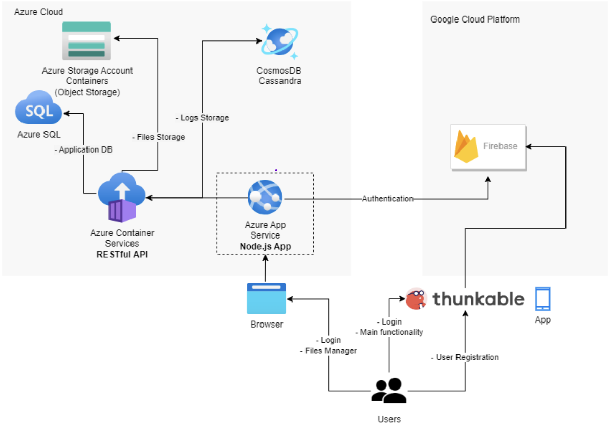
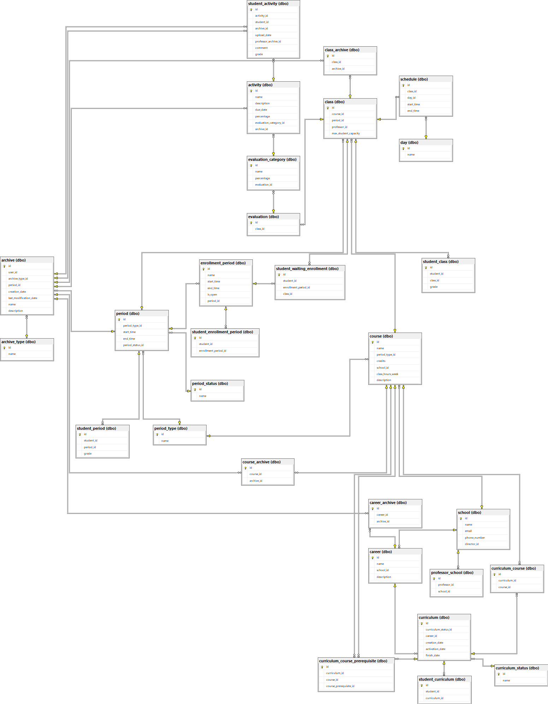

# Documentación

## 1. Diagramas

### 1.1. Diagrama De Arquitectura

### 1.2. Diagrama De La Base De Datos

## 2. Guía De Instalación

## 3. Uso Del Programa

## 4. Pruebas Realizadas

## 5. Resultados De Pruebas Unitarias

## 6. Conclusiones Y Recomendaciones

### 6.1. Conclusiones

### 6.2. Recomendaciones